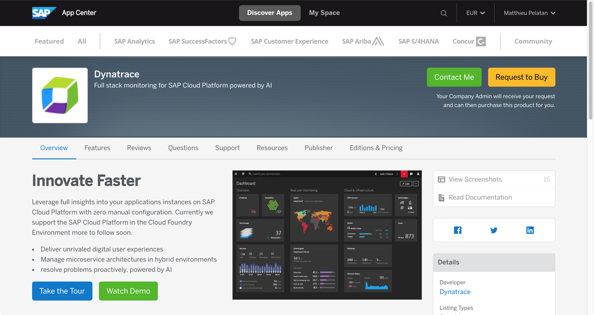
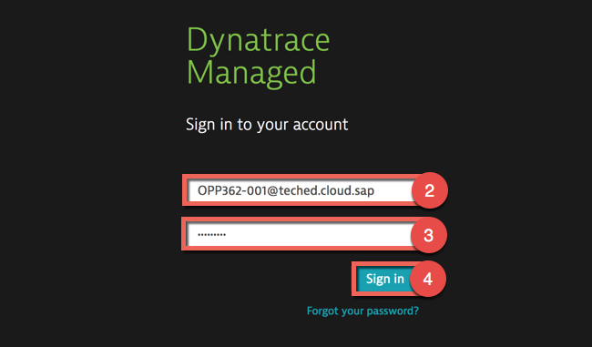

# Lesson C: Application performance using Dynatrace
# Exercise C1: Getting started

#### Objective
In this exercise, you will learn how to get started with the monitoring tool Dynatrace, how to access your dedicated environment and how to generate a PaaS token for your SAP Cloud Platform subaccount.  

#### Estimated time
5 minutes
 

## 1. Introduction to Dynatrace

Dynatrace at SAP is a tool for Application Performance Management (APM), which supports applications that run on SAP Cloud Platform (Neo and Cloud Foundry environments).  

As explained on the [Dynatrace documentation](https://www.dynatrace.com/support/doc/) the Dynatrace OneAgent is responsible for collecting all monitoring data for entities (servers, applications, services, databases,...) within your monitored environment. It discovers all the processes you have running on your hosts. Based on what it finds, the OneAgent automatically activates instrumentation specifically for your unique application stack to send insights to the Dynatrace cluster. 

 #### Core features
 * Monitoring with OneAgent:
      * Auto-discovery of the entire application environment and its topology (structuring with tags, custom detection and naming rules)
      * Single request execution path (PurePaths) to monitor the flow of each request end to end (front-end to backend). Can be enriched by Request Attributes (take care about GDPR relevent data).
      * Cloud & container monitoring (Cloud Foundry, OpenShift, Kubernetes, Docker, AWS, Azure, OpenStack)
      * Host monitoring (CPU, memory, disk utilization every 10 seconds)
      * Web server monitoring (Apache, ISS, Nginx)
      * Deep process monitoring (Java, .NET, PHP, Node.js)
      * Network monitoring (Traffic volume per host/process, TCP errors, connectivity)
      * Real user monitoring
      * Synthetic monitors
      * Extensions and plugins for technologies that are not natively supported

* Problem detection:
    * Automated service performance baselining
    * Automated business impact determination (bounce rates can be configured with real user monitoring)
    * Causation consolidates related issues into a single problem, no alert storms
    * Problem notification integrations (Email, Slack, Jira, SPC, etc.)
    * Alerting profiles
    * End-to-end root cause analysis
    * Automated root cause identification through correlation and AI rules
    * Log analytics

#### Concepts
Dynatrace has its own terminology that is sometimes not intuitive for developers used to the SAP Cloud Platform terminology. Here is a short list about the most important terms:

* **Application**: Web or mobile application in which the Real User Monitoring is enabled. In SAP Cloud Platform, it represents Web-UI part of a Java web application or HTML5 UI served over the HTML5 runtime with manually integrated Dynatrace tracking scripts.)
* **Service**: A set of code that accepts requests and returns results. In SAP Cloud Platform, it represents the different "parts" of a process that can be seen as a business entity, i.e., set of endpoints. The actual granularity of services is technology-dependent and Dynatrace will automatically identify services for your monitored processes based on the technologies you used to implement them.
* **Purepath**: It's the horizontal view of a transaction in a monitored application environment. It is end-to-end, across all tiers of the transaction, from user requests to back-end database queries. [Purepaths]( https://www.dynatrace.com/support/help/server-side-services/service-analysis/how-does-purepath-visualization-help-me-analyze-web-requests-end-to-end/) allow you to analyse web requests end-to-end.
* **Backtrace**: A service backtrace allows you to explore the [origin of a service request](https://www.dynatrace.com/support/help/server-side-services/service-analysis/how-can-i-explore-the-origin-of-service-requests/).
* **Baselining**: A baseline describes the normal behavior of a service in terms of response time and service failure rates. Dynatrace automatically learns baselines via Artificial Intelligence. Baselines can be used for prediction-based anomaly detection instead of defining fixed thresholds. Baselining is guaranteed to be effective after 7 days of moderate load (50 req/min). Basic baselines may be available after 48 hours.
  

> Note: Your Neo/Cloud Foundry applications run over one or more application processes. All processes running the same Neo/Cloud Foundry application are together in a Dynatrace's process group. Each application process in Neo runs on a different Virtual Machine, which in Dynatrace is represented as a host. 
Application processes on both Neo and Cloud Foundry are subdivided by Dynatrace into one or more services.

[//]: # (
https://github.wdf.sap.corp/cloud-native-dev/resilience/tree/master/Observability
https://wiki.wdf.sap.corp/wiki/display/HCPPerf/Mapping+Dynatrace%27s+concepts+to+SAP+Cloud+Platforms
)
  

## 2. Get a Dynatrace account from the SAP App Center
If you don't have a Dynatrace account yet, you can get one from the [SAP App Center](https://www.sapappcenter.com/apps/16545/dynatrace#!overview). Click the **Buy Now** button to initiate the purchase order in the SAP App Center.
     

 
> Note: As this is a pay-as-you-go service, you will only be billed for what you use. To make it easy Dynatrace gives a credit of 1.000 host hours and 50.000 user sessions and 30.000 web checks.

 

As alternative, you can of course create a [free trial account](https://www.dynatrace.com/trial/) and test Dynatrace for 15 days.
     
  
 

For our TechEd session, Dynatrace has sponsored a dedicated cluster. That means that we have a trial landscape only for us. All the users have been created so that you don't need to register. See details below to login.

> Note: you can of course do exactly the same exercises with a Dynatrace trial environment later on. Please just note that the URL of the Dynatrace environment will have a different structure and the attribute apiurl of the user-provided service is not needed (see [documentation](https://www.dynatrace.com/support/help/cloud-platforms/cloud-foundry/application-only/deployment/deploy-oneagent-on-sap-cloud-platform-for-application-only-monitoring/) for more details).

 

## 3. Login into your Dynatrace environment and create a token
1. Go to `https://tgo909.dynatrace-managed.com/login` and insert your credentials:
    * Username: `<YOUR-DYNATRACE-USERNAME>` (e.g. OPP362-001@teched.cloud.sap)
    * Password: `Welcome18`     
      
     

1. In the navigation menu, scroll down to the **Manage** section and select **Deploy Dynatrace**. Then press the button **Set up PaaS integration**.  
      
     

1. Your environment ID appears in the Environment ID text box. This ID will be needed later on to link your Dynatrace account with your SAP cloud Platform account. But for now, let's generate a PaaS token by clicking on the button **Generate new token**.   
      

    > Note: The PaaS token is essentially an API token that's used in combination with your environment ID to download Dynatrace OneAgent. As you will notice, there is already a default InstallerDownload token available that you could alternatively use. However, for security reasons, it is recommended that you create several discrete tokens for different environments.

     

1. Type in a meaningful name (e.g. `sapcp-trial`) for your PaaS token and press the button **Generate** to create the PaaS token.  
     

    > Note: To view and manage your existing PaaS tokens, go to **Settings** > **Integration** > **Platform as a Service**.

       

[ Previous exercise](../B3/README.md) ｜ [ Overview page](../../README.md) ｜ [ Next exercise](../C2/README.md)
